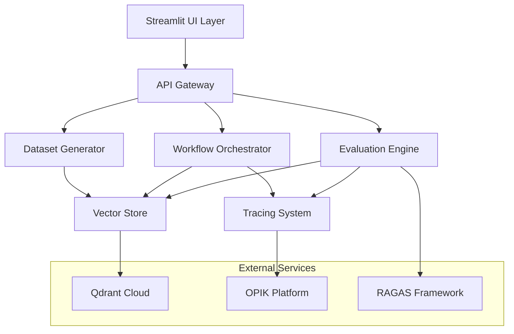

# RAG Evaluation Pipeline Design Document

## Overview

The RAG Evaluation Pipeline is a production-ready system designed to provide comprehensive evaluation, monitoring, and tracing capabilities for Retrieval-Augmented Generation workflows. The system integrates multiple specialized components to create a cohesive evaluation ecosystem that supports both development and production use cases.

The architecture follows a microservices approach with clear separation of concerns, enabling scalability, maintainability, and extensibility. The system supports multiple evaluation methodologies, real-time monitoring, and provides both programmatic and user-friendly interfaces for interaction.

## Architecture

The system follows a layered architecture with the following main components:



### Component Responsibilities

- **UI Layer**: Streamlit-based interface for user interaction and visualization
- **API Gateway**: RESTful API for programmatic access and service coordination
- **Evaluation Engine**: Core evaluation logic using RAGAS and custom metrics
- **Workflow Orchestrator**: LangGraph-based orchestration of complex workflows
- **Tracing System**: OPIK integration for observability and monitoring
- **Vector Store**: Qdrant integration for vector storage and similarity search
- **Dataset Generator**: Automated creation of evaluation datasets from knowledge graphs

## Components and Interfaces

### Evaluation Engine

The Evaluation Engine serves as the core component responsible for assessing RAG system performance using multiple methodologies.

**Key Interfaces:**
- `evaluate_rag_system(query, context, response) -> EvaluationResult`
- `run_binary_evaluation(test_cases) -> BinaryResults`
- `execute_rag_triad(dataset) -> TriadMetrics`
- `llm_as_judge_evaluation(responses, criteria) -> JudgeResults`

**Integration Points:**
- RAGAS framework for standard metrics (faithfulness, answer relevancy, context precision)
- Custom binary evaluation logic for pass/fail assessments
- LLM-based judging for qualitative assessments
- Vector store for retrieval quality evaluation

### Workflow Orchestrator

Built on LangGraph, the Workflow Orchestrator manages complex, multi-step evaluation processes with state management and error handling.

**Key Interfaces:**
- `create_workflow(workflow_definition) -> WorkflowId`
- `execute_workflow(workflow_id, inputs) -> WorkflowResult`
- `get_workflow_state(workflow_id) -> WorkflowState`
- `handle_workflow_error(workflow_id, error) -> ErrorResponse`

**State Management:**
- Persistent state storage for long-running evaluations
- Checkpoint and resume capabilities
- Parallel execution support for independent evaluation tasks

### Vector Store Interface

Provides abstraction over Qdrant vector database operations with optimized performance for RAG evaluation scenarios.

**Key Interfaces:**
- `store_embeddings(collection_name, vectors, metadata) -> StorageResult`
- `similarity_search(query_vector, collection_name, top_k) -> SearchResults`
- `create_collection(name, vector_config) -> CollectionId`
- `manage_collection(collection_id, operation) -> OperationResult`

**Configuration:**
- Qdrant cluster endpoint: `https://55e5707b-2a70-4486-a3cc-25a0b03ade8c.us-east4-0.gcp.cloud.qdrant.io`
- Authentication via API key
- Optimized indexing for evaluation workloads

### Tracing System

OPIK integration provides comprehensive observability across all system components with detailed execution tracking.

**Key Interfaces:**
- `start_trace(operation_name, metadata) -> TraceId`
- `log_event(trace_id, event_data) -> EventId`
- `end_trace(trace_id, result) -> TraceResult`
- `query_traces(filters) -> TraceCollection`

**Monitoring Capabilities:**
- Real-time performance metrics
- Error tracking and alerting
- Execution path visualization
- Custom dashboard creation

### Dataset Generator

Automated creation of evaluation datasets using knowledge graph transformations and synthetic data generation.

**Key Interfaces:**
- `generate_from_knowledge_graph(graph_data) -> EvaluationDataset`
- `create_synthetic_dataset(domain, size) -> SyntheticDataset`
- `validate_dataset_quality(dataset) -> QualityReport`
- `export_dataset(dataset, format) -> ExportResult`

## Data Models

### EvaluationResult
```python
@dataclass
class EvaluationResult:
    evaluation_id: str
    timestamp: datetime
    metrics: Dict[str, float]
    binary_results: Dict[str, bool]
    triad_scores: TriadMetrics
    metadata: Dict[str, Any]
    trace_id: str
```

### TriadMetrics
```python
@dataclass
class TriadMetrics:
    retrieval_quality: float
    generation_quality: float
    overall_performance: float
    component_scores: Dict[str, float]
```

### WorkflowState
```python
@dataclass
class WorkflowState:
    workflow_id: str
    status: WorkflowStatus
    current_step: str
    completed_steps: List[str]
    state_data: Dict[str, Any]
    error_info: Optional[ErrorInfo]
```

### EvaluationDataset
```python
@dataclass
class EvaluationDataset:
    dataset_id: str
    questions: List[str]
    contexts: List[List[str]]
    ground_truth_answers: List[str]
    metadata: Dict[str, Any]
    quality_score: float
```

## Correctness Properties

*A property is a characteristic or behavior that should hold true across all valid executions of a system-essentially, a formal statement about what the system should do. Properties serve as the bridge between human-readable specifications and machine-verifiable correctness guarantees.*

### Property Reflection

After analyzing all acceptance criteria, several properties can be consolidated to eliminate redundancy:

- Properties 1.3 and 7.2 both test binary evaluation output format - these can be combined
- Properties 3.1 and vector persistence can be verified through round-trip testing
- Properties 5.1, 5.2, and 5.4 all test tracing completeness - these can be combined into comprehensive tracing property
- Properties 6.1 and dataset generation can be tested through transformation consistency

### Core Properties

**Property 1: RAGAS Framework Integration**
*For any* evaluation request, processing through the Evaluation Engine should utilize RAGAS framework metrics and return structured evaluation results
**Validates: Requirements 1.1**

**Property 2: Knowledge Graph Dataset Transformation**
*For any* valid knowledge graph input, the Dataset Generator should produce a well-formed evaluation dataset with questions, contexts, and ground truth answers
**Validates: Requirements 1.2**

**Property 3: Binary Evaluation Consistency**
*For any* evaluation request in binary mode, the Evaluation Engine should return only boolean pass/fail results without numerical scores
**Validates: Requirements 1.3, 7.2**

**Property 4: RAG-Triad Completeness**
*For any* RAG-Triad evaluation request, the output should contain assessments for all three components: retrieval quality, generation quality, and overall system performance
**Validates: Requirements 1.4**

**Property 5: LLM Judge Integration**
*For any* LLM-as-a-Judge evaluation request, the system should invoke language model assessment and return properly formatted judgment results
**Validates: Requirements 1.5**

**Property 6: Workflow State Management**
*For any* workflow execution, state transitions should follow LangGraph patterns and maintain consistency across all execution steps
**Validates: Requirements 2.1, 2.4**

**Property 7: Multi-Actor Coordination**
*For any* workflow involving multiple actors, the orchestrator should coordinate interactions without conflicts or race conditions
**Validates: Requirements 2.2, 2.5**

**Property 8: Graceful Error Handling**
*For any* workflow error condition, the system should handle it gracefully and provide meaningful feedback without system failure
**Validates: Requirements 2.3**

**Property 9: Vector Storage Round-Trip**
*For any* vector embedding submitted to the Vector Store, retrieving it through similarity search should return the original vector with high accuracy
**Validates: Requirements 3.1, 3.5**

**Property 10: Search Performance Bounds**
*For any* similarity search request, the Vector Store should return results within acceptable latency thresholds regardless of collection size
**Validates: Requirements 3.2**

**Property 11: Collection Management Operations**
*For any* collection management operation (create, delete, modify), the Vector Store should execute it successfully and maintain data integrity
**Validates: Requirements 3.4**

**Property 12: Visualization Completeness**
*For any* evaluation result, the User Interface should generate clear, actionable visualizations that include all relevant metrics and insights
**Validates: Requirements 4.2**

**Property 13: Real-Time Metrics Display**
*For any* active monitoring session, the User Interface should display current performance indicators with minimal latency
**Validates: Requirements 4.4**

**Property 14: Configuration Interface Availability**
*For any* evaluation configuration request, the User Interface should provide intuitive options that allow complete system customization
**Validates: Requirements 4.5**

**Property 15: Comprehensive Tracing**
*For any* RAG operation, the Tracing System should capture complete execution traces with appropriate context, metadata, and timing information
**Validates: Requirements 5.1, 5.2, 5.4**

**Property 16: Performance Monitoring Completeness**
*For any* monitoring period, the Tracing System should track latency, throughput, and error rates for all system components
**Validates: Requirements 5.3**

**Property 17: Alert Responsiveness**
*For any* configured alert condition, the Tracing System should notify operators when thresholds are exceeded or anomalies are detected
**Validates: Requirements 5.5**

**Property 18: Dataset Diversity Generation**
*For any* dataset generation request requiring diversity, the output should contain varied question-answer pairs with measurable diversity metrics
**Validates: Requirements 6.2**

**Property 19: Ground Truth Consistency**
*For any* evaluation dataset, generated reference answers should be consistent with the source knowledge and suitable for evaluation purposes
**Validates: Requirements 6.3**

**Property 20: Quality Validation Enforcement**
*For any* dataset with quality control enabled, the Dataset Generator should validate content accuracy and reject substandard outputs
**Validates: Requirements 6.4**

**Property 21: Format Support Flexibility**
*For any* supported output format request, the Dataset Generator should produce valid datasets in the specified format
**Validates: Requirements 6.5**

**Property 22: Numerical Metrics Provision**
*For any* score-based evaluation request, the Evaluation Engine should return numerical performance metrics within valid ranges
**Validates: Requirements 7.1**

**Property 23: A/B Testing Capability**
*For any* comparative analysis request, the Evaluation Engine should support simultaneous evaluation of different RAG configurations
**Validates: Requirements 7.3**

**Property 24: Report Completeness**
*For any* evaluation report generation, the output should include detailed breakdowns by all relevant evaluation criteria
**Validates: Requirements 7.4**

**Property 25: Threshold-Based Flagging**
*For any* configured performance threshold, the Evaluation Engine should automatically flag issues when metrics exceed acceptable limits
**Validates: Requirements 7.5**

**Property 26: Authentication and Rate Limiting**
*For any* external API connection, the Integration Layer should handle authentication and implement appropriate rate limiting
**Validates: Requirements 8.1**

**Property 27: Retry Logic Implementation**
*For any* service failure, the Integration Layer should implement exponential backoff retry logic until success or maximum attempts
**Validates: Requirements 8.2**

**Property 28: Data Consistency Maintenance**
*For any* data flow between services, the Integration Layer should ensure consistency and integrity throughout the transfer
**Validates: Requirements 8.3**

**Property 29: Hot Configuration Updates**
*For any* configuration change, the Integration Layer should update service connections without requiring system restart
**Validates: Requirements 8.4**

**Property 30: Dependency Health Monitoring**
*For any* external dependency, the Integration Layer should continuously track service health and availability status
**Validates: Requirements 8.5**

## Error Handling

The system implements comprehensive error handling across all components:

### Evaluation Engine Errors
- **Invalid Input Handling**: Graceful degradation when evaluation inputs are malformed
- **RAGAS Framework Errors**: Fallback mechanisms when RAGAS evaluation fails
- **Timeout Management**: Configurable timeouts for long-running evaluations
- **Resource Exhaustion**: Proper handling when system resources are insufficient

### Workflow Orchestrator Errors
- **State Corruption**: Recovery mechanisms for corrupted workflow state
- **Actor Failures**: Isolation and recovery when individual actors fail
- **Deadlock Prevention**: Detection and resolution of workflow deadlocks
- **Checkpoint Recovery**: Ability to resume from last successful checkpoint

### Vector Store Errors
- **Connection Failures**: Automatic reconnection with exponential backoff
- **Index Corruption**: Detection and rebuilding of corrupted indices
- **Query Timeouts**: Graceful handling of slow or failed queries
- **Capacity Limits**: Proper error messages when storage limits are reached

### Integration Layer Errors
- **API Rate Limits**: Intelligent backoff when external APIs are rate-limited
- **Authentication Failures**: Automatic token refresh and re-authentication
- **Network Partitions**: Resilient operation during network connectivity issues
- **Service Unavailability**: Circuit breaker pattern for failing external services

## Testing Strategy

The testing strategy employs a dual approach combining unit testing and property-based testing to ensure comprehensive coverage and correctness validation.

### Unit Testing Approach

Unit tests focus on specific examples, edge cases, and integration points:

- **Component Integration Tests**: Verify proper interaction between system components
- **API Endpoint Tests**: Validate REST API responses and error handling
- **Configuration Tests**: Ensure proper system behavior with various configurations
- **Edge Case Validation**: Test boundary conditions and unusual input scenarios

### Property-Based Testing Approach

Property-based testing verifies universal properties across all valid inputs using **Hypothesis** for Python-based components:

- **Minimum 100 iterations** per property test to ensure statistical confidence
- **Custom generators** for domain-specific data types (evaluation requests, knowledge graphs, vector embeddings)
- **Shrinking strategies** to find minimal failing examples when properties are violated
- **Stateful testing** for workflow orchestration and state management validation

### Testing Framework Configuration

- **Primary Framework**: pytest for unit tests, Hypothesis for property-based tests
- **Coverage Requirements**: Minimum 90% code coverage for core components
- **Performance Testing**: Automated benchmarks for critical performance paths
- **Integration Testing**: End-to-end tests using real external services in staging environment

### Property Test Implementation Requirements

Each property-based test must:
- Run a minimum of 100 iterations for statistical validity
- Include explicit comments referencing the design document property
- Use the format: `**Feature: rag-evaluation-pipeline, Property {number}: {property_text}**`
- Implement appropriate data generators for the specific property domain
- Include proper assertion messages for debugging failed properties

### Continuous Testing Integration

- **Pre-commit Hooks**: Run fast unit tests before code commits
- **CI/CD Pipeline**: Execute full test suite including property-based tests
- **Nightly Builds**: Extended property testing with increased iteration counts
- **Performance Regression**: Automated detection of performance degradation